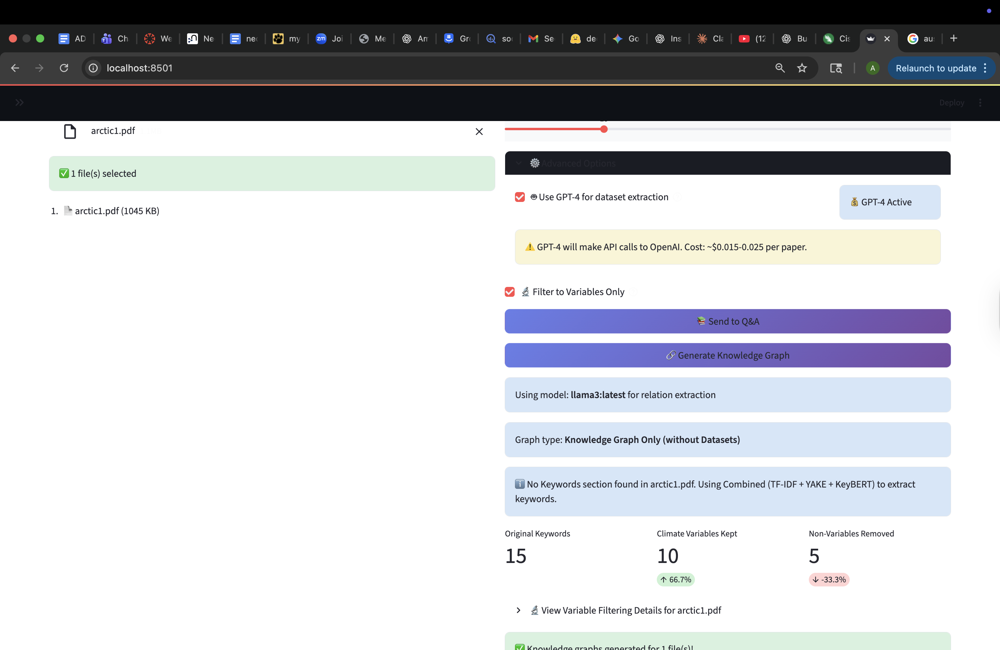
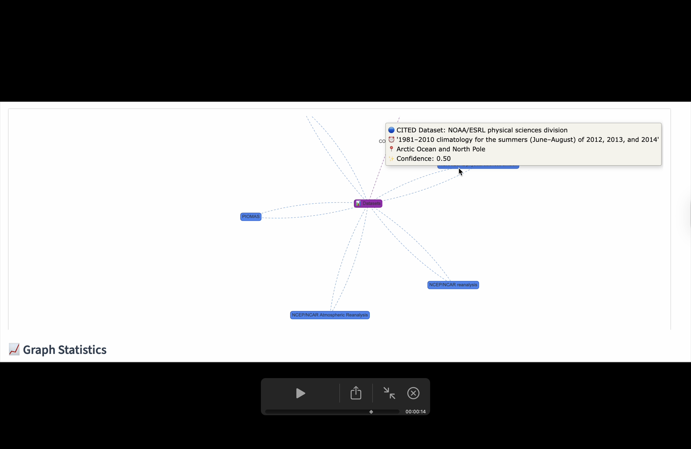
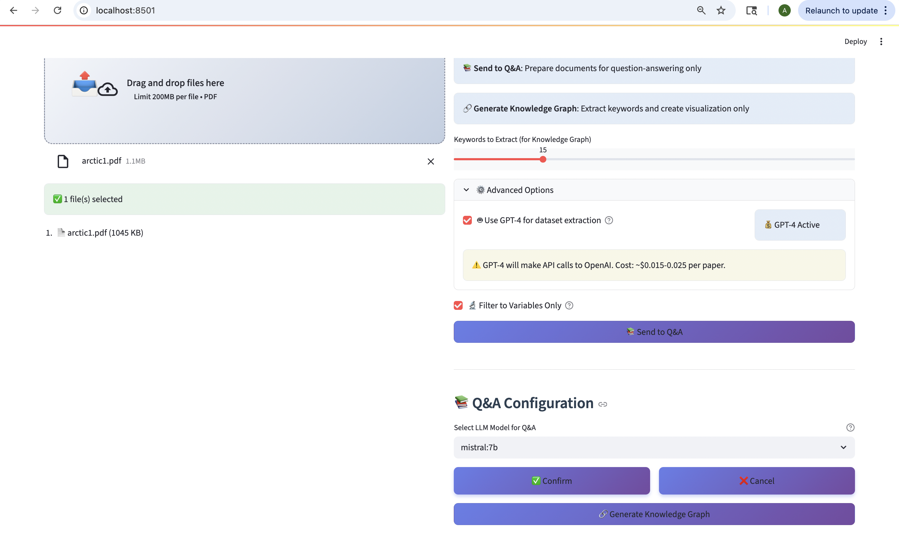
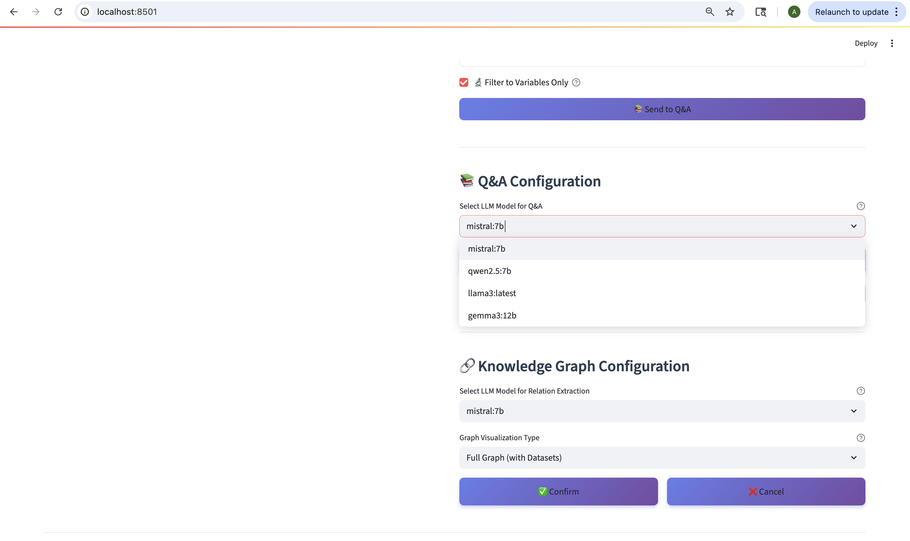
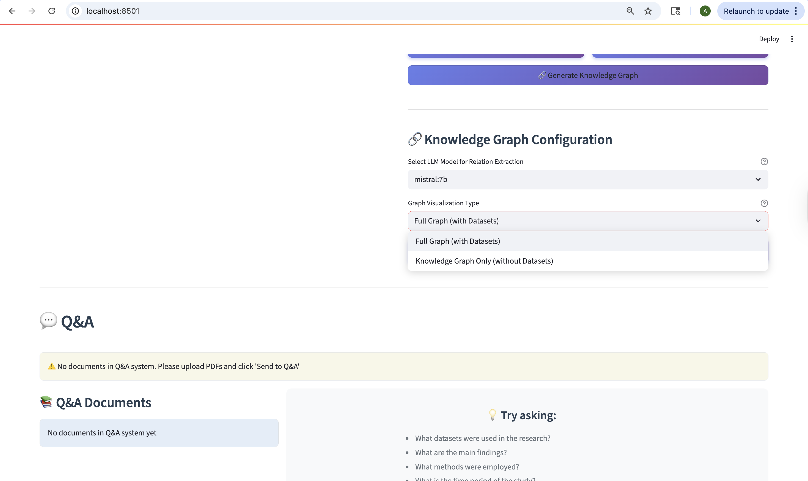

# PDF to Knowledge Graph Generator

A local, private, and intelligent system to extract keywords and semantic relationships from uploaded research PDFs and generate an interactive Knowledge Graph.
Built with Streamlit, Neo4j, Ollama, GPT-4o-mini, and PyVis.

## Table of Contents

- [Overview](#overview)
- [Features](#features)
- [Tech Stack](#tech-stack)
- [GitHub Setup Instructions](#github-setup-instructions)
  - [1. Clone the Repository](#1-clone-the-repository)
  - [2. Create a Virtual Environment](#2-create-a-virtual-environment)
  - [3. Install Dependencies](#3-install-dependencies)
  - [4. Configure Environment Variables](#4-configure-environment-variables)
  - [5. Install and Run Ollama](#5-install-and-run-ollama)
  - [6. Setup Neo4j Aura](#6-setup-neo4j-aura)
  - [7. Run the Streamlit App](#7-run-the-streamlit-app)
- [Project Folder Structure](#project-folder-structure)
- [How It Works](#how-it-works)
- [Graph Visualization Modes](#graph-visualization-modes)
- [Model Selection](#model-selection)
- [Key Components](#key-components)
- [Example Workflow](#example-workflow)
- [Future Enhancements](#future-enhancements)
- [Example Flow](#example-flow)
- [Author](#author)
- [Final Notes](#final-notes)

---

## Overview

This project allows users to upload one or more research papers (PDFs), automatically extract the key concepts, and generate an interactive Knowledge Graph.
It uses advanced keyword extraction (TF-IDF, YAKE, KeyBERT), GPT-4o-mini for intelligent dataset extraction with PRIMARY/CITED classification, and LLM-based relation extraction (using multiple Ollama models) to build meaningful graphs for scientific documents. The system also includes a RAG-based Q&A module for querying uploaded documents.


*Main interface showing PDF upload, GPT-4 dataset extraction options, keyword filtering, and model/graph type selection*

---

## Features

### Core Functionality

- Upload single or multiple PDFs (drag-and-drop or browse, 200MB limit per file)
- Intelligent keyword extraction from Keywords section if present, else model-based extraction
- Configurable keyword count slider for Knowledge Graph generation (adjustable per document)
- Relation extraction between keywords using Ollama LLMs (mistral, qwen2.5, llama3, gemma3)
- Dialog-based model selection for Q&A and Knowledge Graph generation with Confirm/Cancel workflow
- Q&A System with RAG: Ask questions about uploaded documents using Retrieval-Augmented Generation

### Advanced Options

- GPT-4 Dataset Extraction Toggle:
  - Checkbox to enable/disable GPT-4o-mini dataset extraction
  - "GPT-4 Active" status badge when enabled
  - Real-time cost estimation displayed (approximately $0.015-0.025 per paper)
  - Automatic detection of OpenAI API key from environment
- Filter to Variables Only:
  - Checkbox to filter extracted keywords to climate/domain-specific variables
  - Displays filtering statistics (Original, Variables Kept, Non-Variables Removed)
  - Expandable details section showing which keywords were filtered and why
  - Improves graph quality by focusing on scientific variables
### Dataset Extraction (GPT-4o-mini)

- Automatic classification of datasets as PRIMARY (created by authors) or CITED (from other sources)
- Extraction of dataset metadata: source name, variables, time period, location, usage description, citation info
- Chunk-based processing (3000 characters with 500-character overlap) for handling long documents
- Confidence scoring for each extracted dataset
- Deduplication of dataset mentions across document chunks
- Cost tracking for API usage (input/output tokens and total cost per document)
- Real-time processing status with chunk progress indicators

### Graph Visualization

- Two Graph Visualization Modes:
  - Full Graph with Datasets: Hub-based collapsible view with interactive double-click expansion
  - Knowledge Graph Only: Keywords and relations without dataset nodes
- Enhanced Visual Elements:
  - Purple hub node for collapsible dataset expansion (size 35, distinct from keywords)
  - Green boxes for PRIMARY datasets (author-created data)
  - Blue boxes for CITED datasets (referenced from other sources)
  - Yellow circles for variables (automatically detected)
  - Default styling for regular keywords
  - Detailed tooltips with dataset metadata (type, time period, location, usage, confidence)
- Interactive Graph Statistics Panel:
  - Unique Nodes count
  - Total Relations count
  - Datasets Found count
  - Average Relations per File
- Graph physics controls (repulsion distance: 200, spring length: 300)
- Real-time graph type indicator displaying current visualization mode

### User Interface Features

- Processing Status Messages:
  - Selected model display (e.g., "Using model: llama3:latest for relation extraction")
  - Current graph type display (e.g., "Graph type: Knowledge Graph Only (without Datasets)")
  - Keyword extraction method notification
  - Success/failure indicators for each processing step
- File Management:
  - Visual file list showing uploaded PDFs with file sizes
  - Success indicator when files are uploaded
  - Individual file removal capability
- Session Persistence:
  - Separate tracking for Q&A documents and processed PDFs
  - Graph type stored with each processed file
  - Model selection persists across operations until manually changed
- Export Capabilities:
  - Download extracted relations as CSV
  - Download extracted relations as JSON
  - Export includes all metadata and relationship information

### Privacy and Performance

- 100% Local Processing for keywords and relations extraction (Privacy-Preserving)
- Optional cloud-based dataset extraction with GPT-4o-mini for enhanced accuracy
- Configurable processing pipeline (enable/disable individual features)
- No data sent to external services except when GPT-4 extraction is explicitly enabled

---

## Tech Stack

- Python 3.10+
- Streamlit (Frontend App)
- pdfplumber (PDF Text Extraction)
- NLTK, spaCy (Text Cleaning)
- TF-IDF, YAKE, KeyBERT (Keyword Extraction)
- OpenAI GPT-4o-mini (Dataset Extraction with PRIMARY/CITED Classification)
- Ollama with Multiple Model Support:
  - mistral:7b (Default for relation extraction)
  - qwen2.5:7b
  - llama3:latest
  - gemma3:12b
- Neo4j Aura (Graph Storage with Enhanced Dataset Support)
- PyVis (Interactive Graph Visualization with Hub-Based Expansion)
- SentenceTransformers (Semantic Scoring and Document Embeddings for RAG)
- python-dotenv (Environment Variable Management)

---

## GitHub Setup Instructions

### 1. Clone the Repository
```bash
git clone https://github.com/your-username/pdf-knowledge-graph.git
cd pdf-knowledge-graph
```

### 2. Create a Virtual Environment
```bash
python3 -m venv venv
source venv/bin/activate  # On Windows: venv\Scripts\activate
```

### 3. Install Dependencies
```bash
pip install -r requirements.txt
```

### 4. Configure Environment Variables

Create a `.env` file in the `Knowledge_graph` directory (parent directory of Code folder) with the following credentials:

```bash
# OpenAI API Configuration (for dataset extraction)
OPENAI_API_KEY=your_openai_api_key_here

# Neo4j Aura Configuration
NEO4J_URI=neo4j+s://your-instance-id.databases.neo4j.io
NEO4J_USER=neo4j
NEO4J_PASSWORD=your_neo4j_password_here
NEO4J_DATABASE=neo4j
```

Note: The OPENAI_API_KEY is required for GPT-4o-mini dataset extraction. If not provided, the system will skip dataset extraction.

### 5. Install and Run Ollama

Install Ollama and pull the required models:
```bash
# Pull default model
ollama pull mistral:7b

# Optional: Pull additional models for different capabilities
ollama pull qwen2.5:7b
ollama pull llama3:latest
ollama pull gemma3:12b

# Start Ollama server
ollama serve
```

### 6. Setup Neo4j Aura

1. Create a free Neo4j Aura instance at https://console.neo4j.io
2. Wait 60 seconds for the instance to become available
3. Copy the connection credentials from the Python driver section
4. Add credentials to your `.env` file

### 7. Run the Streamlit App

Navigate to the Code directory and run:
```bash
cd Knowledge_graph/Code
streamlit run frontend_light.py
```

---

## Project Folder Structure

```bash
pdf-knowledge-graph/
├── .env                        # Environment variables (OpenAI API key, Neo4j credentials)
├── Code/
│   ├── frontend_light.py       # Main Streamlit app with dialog-based model selection
│   ├── keywords_extraction.py  # Keyword and relation extraction with Ollama integration
│   ├── dataset_extraction_gpt4.py  # GPT-4o-mini dataset extractor with PRIMARY/CITED classification
│   ├── neo4j_storage.py        # Neo4j connector with hub-based graph visualization
│   ├── qa_module.py            # RAG-based Q&A system for document queries
│   ├── storing.py              # Optional CLI mode to process PDFs
│   └── requirements.txt        # Python dependencies
└── README.md                   # Project documentation
```

---

## How It Works

### 1. PDF Upload
Upload one or more PDF documents via the Streamlit interface.

### 2. Text Extraction
Extracts text using `pdfplumber` from uploaded PDFs. The system handles multi-column layouts and maintains text structure.

### 3. Model Selection
When initiating Q&A or Knowledge Graph generation, users are presented with dialog boxes to select:
- LLM model for processing (mistral:7b, qwen2.5:7b, llama3:latest, gemma3:12b)
- Graph visualization type (Full Graph with Datasets or Knowledge Graph Only)
- Confirm or Cancel actions before processing begins

### 4. Processing Options

#### Option A: Knowledge Graph Generation

**Keyword Extraction:**
- If a "Keywords" section exists in the PDF, directly extract those keywords
- Otherwise, fallback to automatic extraction using TF-IDF, YAKE, and KeyBERT
- For multiple PDFs, automatically extract roughly k/n keywords per PDF (where n = number of PDFs)

**Dataset Information Extraction (GPT-4o-mini):**
- Document split into 3000-character chunks with 500-character overlap for comprehensive coverage
- Each chunk processed independently by GPT-4o-mini API
- Automatic classification of every dataset mention as PRIMARY or CITED:
  - PRIMARY: Datasets the authors of the paper created, collected, or generated ("We deployed", "Our model ran")
  - CITED: Datasets from other sources that are referenced or used ("Forced by ERA5", "According to NASA")
- Extracted metadata for each dataset:
  - Source name and identifier
  - Measured variables and parameters
  - Time period (YYYY-YYYY format or "Not specified")
  - Geographic location
  - Usage description (how authors used the dataset)
  - Citation information (for CITED datasets)
  - Confidence score (0.0 to 1.0)
- Deduplication across chunks using fuzzy matching (70% similarity threshold)
- Cost tracking: Input/output tokens calculated, costs displayed per document and in total
- Creates specialized Dataset nodes in Neo4j with dual labels:
  - All datasets: `:Dataset` label
  - PRIMARY datasets: `:Dataset:PrimaryDataset` labels
  - CITED datasets: `:Dataset:CitedDataset` labels
- Marks dataset variables as dual-labeled nodes (`:Keyword:Variable`)
- Establishes relationships:
  - `HAS_VARIABLE`: Links datasets to their measured variables
  - `EXTRACTED_FROM`: Links datasets to extracted keywords

**Relation Extraction:**
- Keyword pairs passed to selected Ollama model to infer semantic relations
- Uses structured prompts to extract causal, correlational, and other semantic relationships
- Relations normalized to valid Neo4j relationship types (uppercase, underscores)

**Graph Construction and Storage:**
- Stores all nodes and relationships in Neo4j with complete dataset context
- Dual-label system allows efficient querying by dataset type
- Metadata stored as node properties for rich tooltips

#### Option B: Q&A System

**Document Processing:**
- Splits text into overlapping 800-word chunks for better context retrieval
- Generates vector embeddings using SentenceTransformer (all-MiniLM-L6-v2)
- Maintains document structure and source information

**RAG Implementation:**
- Stores document chunks with their embeddings in memory
- Uses cosine similarity for semantic search (threshold: 0.15)
- Retrieves top-k relevant chunks for each query
- Combines multiple sources for comprehensive answers

**Answer Generation:**
- Combines relevant chunks as context
- Uses selected Ollama model to generate contextual answers
- Includes source citations from retrieved documents
- Maintains conversation history for follow-up questions

### 5. Visualization & Interaction

**Knowledge Graph Visualization:**
Interactive PyVis network with two distinct modes based on user selection during generation.

**Q&A Interface:**
Chat-based interface with conversation history, context-aware responses, and clear source attribution.

### 6. Export Options
Users can download the extracted relations as CSV or JSON files directly from the interface.

---

## Graph Visualization Modes

The system offers two distinct graph visualization modes selected via dialog during Knowledge Graph generation:

### Full Graph (with Datasets)

**Hub-Based Collapsible Visualization:**
- Initial View: Clean graph showing only keyword nodes, relations, and a single purple "Datasets" hub node
- Hub Node Display:
  - Label: "Datasets" with icon
  - Color: Purple (distinct from all other node types)
  - Tooltip shows: Number of PRIMARY datasets, number of CITED datasets, and double-click instruction
  - Size: Larger than regular nodes (35 vs 25) for visibility
  - Connected to a central keyword node with dashed purple "CONTAINS" relationship

**Interactive Expansion:**
- Double-click the hub node to expand and view all individual datasets
- Expansion creates:
  - GREEN boxes for PRIMARY datasets (datasets created by the paper authors)
  - BLUE boxes for CITED datasets (datasets referenced from other sources)
  - Dashed connections from hub to each dataset node
  - Detailed tooltips for each dataset including:
    - Dataset type (PRIMARY or CITED)
    - Time period
    - Geographic location
    - Usage description
    - Confidence score
- Double-click hub again to collapse back to clean view
- JavaScript-powered interaction embedded in the visualization HTML


*Interactive hub expansion showing purple hub node with CITED datasets (blue boxes) radiating outward, detailed tooltip displaying dataset metadata*

**Benefits:**
- Keeps initial graph clean and focused on keyword relationships
- Allows users to explore datasets on-demand without cluttering the visualization
- Clear visual distinction between author-created and referenced datasets
- Scales well with papers containing many dataset mentions (10-30+ datasets)

### Knowledge Graph Only (without Datasets)

**Clean Keyword-Focused Visualization:**
- Shows only keyword nodes and their semantic relationships
- No dataset hub, no dataset nodes at all
- Variable nodes still displayed in yellow for context
- Ideal for understanding conceptual relationships without data provenance
- Lighter weight visualization for papers where dataset information is less critical

**Use Cases:**
- Comparing conceptual frameworks across papers
- Understanding theoretical relationships
- Quick overview of paper topics and themes
- Teaching and presentation contexts where datasets are not the focus

---

## Model Selection

The system provides flexible model selection through dialog-based interfaces:

### Q&A Model Selection
When clicking "Send to Q&A":
1. Dialog appears with model dropdown showing:
   - mistral:7b (lightweight, fast)
   - qwen2.5:7b (balanced performance)
   - llama3:latest (high quality responses)
   - gemma3:12b (largest model, most accurate)
2. User selects preferred model
3. Confirm button initiates Q&A document processing with selected model
4. Cancel button closes dialog without processing


*Q&A Configuration dialog with model selection dropdown and Confirm/Cancel buttons*

### Knowledge Graph Model Selection
When clicking "Generate Knowledge Graph":
1. Dialog appears with two selections:
   - LLM Model dropdown (same options as Q&A)
   - Graph Visualization Type dropdown:
     - "Full Graph (with Datasets)" - Hub-based collapsible view
     - "Knowledge Graph Only (without Datasets)" - Keywords and relations only
2. User configures both options
3. Confirm button initiates processing with selected configuration
4. Cancel button closes dialog without processing


*Both Q&A and Knowledge Graph configuration dialogs showing all available Ollama models (mistral:7b, qwen2.5:7b, llama3:latest, gemma3:12b)*


*Knowledge Graph Configuration with Graph Visualization Type dropdown expanded, showing "Full Graph (with Datasets)" and "Knowledge Graph Only (without Datasets)" options*

### Session Persistence
- Selected models stored in Streamlit session state
- Graph type stored with each processed PDF
- Allows different configurations for different papers in the same session
- Model selection persists until user changes it or refreshes the session

---

## Key Components

### dataset_extraction_gpt4.py - GPT-4o-mini Dataset Extractor

**GPT4DatasetExtractor Class:**
Main class for extracting ALL datasets from research papers with PRIMARY/CITED classification.

Key methods:
- `__init__()`: Initializes OpenAI client with API key from environment
- `_create_extraction_prompt()`: Creates detailed system prompt explaining PRIMARY vs CITED distinction
- `_split_into_chunks()`: Splits document into 3000-character chunks with 500-character overlap
- `_extract_from_chunk()`: Processes single chunk, returns datasets and token usage
- `_deduplicate_datasets()`: Fuzzy matching across chunks (70% similarity threshold)
- `extract_from_full_text()`: Main method that orchestrates extraction:
  - Processes all chunks in sequence
  - Accumulates raw dataset mentions
  - Deduplicates across chunks
  - Calculates total cost (input: $0.150/1M tokens, output: $0.600/1M tokens)
  - Returns DatasetMetadata objects with stats

**DatasetMetadata dataclass:**
- source: Dataset name/identifier
- variables: List of measured parameters
- time_period: Temporal coverage
- location: Geographic coverage
- context: Brief description
- chunk_indices: Which chunks mentioned this dataset
- confidence_score: Extraction confidence (0.0-1.0)
- dataset_type: "primary" or "cited"
- usage_description: How authors used the dataset
- citation_info: Reference information (for CITED datasets)

### keywords_extraction.py - Enhanced Keyword and Relation Extraction

**process() function:**
Enhanced to integrate dataset extraction:
- Accepts llm_model parameter for relation extraction
- Accepts use_gpt4_datasets flag to enable/disable GPT-4 dataset extraction
- Returns tuple: (keywords, relations, datasets, keywords_metadata)
- Extracts keywords using hybrid approach (section-based + model-based)
- Uses selected Ollama model for relation extraction
- Conditionally calls GPT4DatasetExtractor if OpenAI API key is available
- Returns comprehensive extraction statistics including GPT-4 costs

### neo4j_storage.py - Graph Storage with Hub-Based Visualization

**Neo4jConnector class:**

**store_keywords_and_relations():**
Enhanced method that handles datasets:
- Clears existing graph data
- Creates Dataset nodes with dual labels (:Dataset:PrimaryDataset or :Dataset:CitedDataset)
- Stores all dataset properties (time_period, location, dataset_type, usage_description, citation_info, confidence)
- Marks variables with :Variable label for special styling
- Creates HAS_VARIABLE relationships (dataset to variable)
- Creates EXTRACTED_FROM relationships (dataset to keyword)
- Stores keywords and semantic relationships

**generate_graph(relations, graph_type='with_datasets'):**
Core visualization method with mode support:

For 'with_datasets' mode:
- Queries all datasets from Neo4j with full metadata
- Counts PRIMARY vs CITED datasets
- Creates purple hub node with summary tooltip
- Skips individual dataset nodes in relations loop (hidden initially)
- Adds variable nodes in yellow
- Adds regular keyword nodes with default styling
- Connects hub to central keyword with dashed purple "CONTAINS" edge
- Calls `_generate_expansion_javascript()` to create interactive expansion code
- Returns (network, expansion_js) tuple

For 'without_datasets' mode:
- Skips dataset query entirely
- Skips any dataset nodes found in relations
- Shows only keywords and relations
- Returns (network, "") tuple (empty expansion_js)

**_generate_expansion_javascript(dataset_info):**
Generates JavaScript code for interactive hub expansion:
- Prepares PRIMARY and CITED dataset arrays with metadata
- Creates double-click event handler for hub node
- On first double-click (expand):
  - Creates individual nodes for each PRIMARY dataset (green, positioned above hub)
  - Creates individual nodes for each CITED dataset (blue, positioned below hub)
  - Adds dashed edges from hub to each dataset
  - Builds rich tooltips with all metadata
- On second double-click (collapse):
  - Removes all dataset nodes
  - Clears expansion state
- Returns complete JavaScript code as string for HTML injection

**get_datasets_by_type(dataset_type='all'):**
Utility method for querying datasets:
- 'primary': Returns only PRIMARY datasets (queries :PrimaryDataset label)
- 'cited': Returns only CITED datasets (queries :CitedDataset label)
- 'all': Returns all datasets (queries :Dataset label)
- Returns list of dictionaries with all dataset properties

### qa_module.py - RAG-Based Q&A System

**QASystem class:**
Implements Retrieval-Augmented Generation for document Q&A:
- `__init__()`: Initializes with default Ollama model, sentence transformer embeddings
- `set_model(model_name)`: Changes Ollama model dynamically based on user selection
- `add_document()`: Processes PDF documents:
  - Splits into 800-word chunks with overlap
  - Generates embeddings using all-MiniLM-L6-v2
  - Stores chunks with metadata (filename, chunk index)
- `find_relevant_chunks()`: Semantic search:
  - Embeds query
  - Computes cosine similarity with all chunks
  - Filters by threshold (0.15)
  - Returns top-k most relevant chunks with scores
- `generate_answer()`: Context-aware answer generation:
  - Constructs prompt with relevant context
  - Calls Ollama API with selected model
  - Streams response back
- `answer_question()`: Main Q&A interface:
  - Finds relevant chunks
  - Generates answer
  - Returns answer with source citations

### frontend_light.py - Streamlit Interface with Dialog System

**Session State Management:**
- `processed_pdfs`: Dictionary storing results for each processed PDF (nodes, relations, datasets, graph_type)
- `qa_documents`: List of documents loaded into Q&A system
- `show_qa_dialog`: Boolean flag for Q&A dialog visibility
- `show_kg_dialog`: Boolean flag for Knowledge Graph dialog visibility
- `qa_model_selected`: Stores user's Q&A model choice
- `kg_model_selected`: Stores user's KG model choice
- `kg_graph_type_selected`: Stores user's graph type choice

**Dialog-Based Workflow:**

Q&A Dialog (lines 521-559):
- Triggered by "Send to Q&A" button
- Shows model selection dropdown
- Confirm button:
  - Calls `qa_system.set_model(selected_model)`
  - Processes uploaded PDFs
  - Adds documents to Q&A system
  - Closes dialog
- Cancel button: Closes dialog without processing

Knowledge Graph Dialog (lines 570-600):
- Triggered by "Generate Knowledge Graph" button
- Shows two dropdowns:
  - Model selection for relation extraction
  - Graph type selection (with/without datasets)
- Confirm button:
  - Stores selections in session state
  - Triggers rerun to start processing
  - Closes dialog
- Cancel button: Closes dialog without processing

**Processing Logic:**
- Checks for selected model and graph type in session state
- Maps UI strings to internal parameters ('with_datasets' or 'without_datasets')
- Calls `process()` with selected model
- If GPT-4 extraction enabled, displays cost information
- Stores graph_type with processed PDF metadata
- Passes graph_type to `neo4j_storage.generate_graph()`

**Graph Rendering:**
- Retrieves graph_type from first processed PDF (all PDFs in session use same type)
- Calls `neo.generate_graph(rels, graph_type=graph_type_to_use)`
- Saves graph HTML
- Injects expansion JavaScript: `html_content.replace("</body>", expansion_js + "</body>")`
- Renders with Streamlit HTML component

---

## Example Workflow

Upload PDFs → Select Model → Extract Keywords → Extract Datasets (GPT-4o-mini) → Find Relations (Ollama) → Choose Visualization Mode → View Interactive Graph

OR

Upload PDFs → Select Model → Process for Q&A → Ask Questions → Get Contextual Answers

---

## Future Enhancements

- OCR support for scanned PDFs using Tesseract
- Interactive graph editing (merging/splitting nodes, manual relation addition)
- Fine-tune Ollama models for specific scientific domains
- Automatic summarization of graphs with key insights
- Cross-document relationship discovery in Q&A (linking information across papers)
- Export Q&A conversations and insights to PDF/Word
- Advanced dataset linking: Identify when multiple papers use the same dataset
- Temporal analysis: Track dataset usage trends over time across paper collections
- Export graph in additional formats (GraphML, GEXF, JSON-LD)
- Batch processing mode for processing large paper collections
- Custom extraction rules for domain-specific dataset formats
- Integration with dataset repositories (Zenodo, Figshare, etc.)
- Full-fledged web application with user authentication and multi-user support

---

## Example Flow

- Connect to the server (in my case UNT Server) using ssh command.
- Create venv and install required libraries and go the directory where all .py files are stored.
- Then run ollama serve to pull llama 3.2 from ollama.
- Now open another terminal and go to the same directory where code is present and run frontend_light.py
- Go to new terminal window and then run the following command to connect server to localhost using ssh tunneling.
- Open the localhost link and upload the files.


- You can select any of the following options:
    - Send to Q&A
    - Generate Knowledge Graph.

 

 - Querying Q&A looks like this:


- The below are the results:


  

- Neo4j credentials driver info:

  
  

---

## Author

**Ajith Kumar Dugyala**
Email: ajithdugyala@gmail.com
Location: Denton, Texas, USA

---

## Final Notes

This project combines local processing for privacy-sensitive operations (keyword extraction, relation extraction) with optional cloud-based enhancement (GPT-4o-mini for dataset extraction) to achieve the best balance of accuracy and privacy.

The hub-based visualization approach ensures clean, scalable graph displays even for papers with numerous dataset references. The dual-mode system (with/without datasets) provides flexibility for different use cases and audiences.

All LLM processing can run entirely locally using Ollama models, with the GPT-4 dataset extraction being optional. This makes the system suitable for sensitive research documents while still offering enhanced capabilities when cloud access is available.

---
